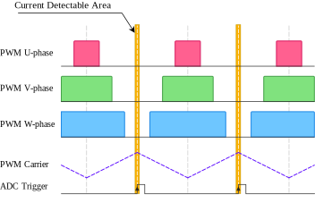
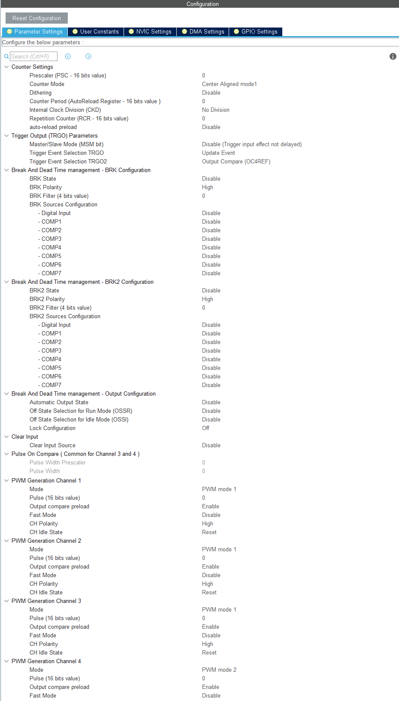

# 概要
PMSMの制御を行う為には、相電流を検出する必要がある。電流検出の際には、PWMリプル除去性能や、回路トポロジーによる検出可能領域の観点から、PWMに同期したサンプリングが多く利用されている。

ここでは以下の条件のもと、電流検出の為のTIM及びADC設定例を紹介する。

## 動作条件
### 環境
- MotorDriverBoard : X-NUCLEO-IHM08M1 (3シャント電流検出)
- MCU : STM32G431 (NUCLEO-G431RB)
- Code Generator : CubeMX Version:5.4.0

### 仕様
- PWMキャリア周期 : 20kHz
- TIMカウントアップ周期 : 170MHz
- TIM周期 : 65535 Count/Rev

# PWMとADCトリガタイミング
今回の構成例の概略図を次に示す。

この構成では、下アームがONの時に相電流がシャント抵抗を通過する。

この事を考慮し、電流検出可能領域は次のようになる。

また、これを電圧ベクトルとして表示したものが次の図である。

一辺の長さがDCLink電圧である$V_{dc}$の正六角形(出力可能範囲)に対して、内接する円は半径が $\frac{\sqrt{3}}{2} V_{dc}$ である。

空間ベクトル変調を利用し、過変調領域を使用しない場合には、この内接円にて電圧を制限する。
この制限により、電圧検出可能領域内に出力となるPWMは侵入せず、必ず下アームが導通した状態となる。

換言すれば、3シャント電流検出では、過変調領域を除いた領域で電流検出が可能である。

この電流検出可能領域で3相全てのアナログ値をサンプリングすることが重要であり、本説での目標となる。

# 供給クロックの確認

# TIM設定
次のように設定する。

## TIM1 Mode and Configuration
- Channel1 : PWM Generation CH1 CH1N
- Channel2 : PWM Generation CH2 CH2N
- Channel3 : PWM Generation CH3 CH3N
- Channel4 : PWM Generation CH4

この設定により、CH1～CH3の出力ピンより相補PWMが出力される。

## TIM1 Mode and Configuration – Configuration – Parameter Setting
### Counter Setting
- Prescaler : 0
- Counter Period : "TODO"
- Counter Mode : Center Aligned mode 1
- Repetition Counter : 1

Prescalerはカウンタレジスタの値が足りない時に設定する。今回は0とする。

Counter PeriodはPWMの周期を設定する。(Counter Modeの設定により周期が変化する事に注意する。)今回は20kHzとするため、"TODO"に設定する。このとき値の計算は、"TODO"で求める。

Counter ModeはPWMキャリアの波形を設定する。のこぎり波又は三角波から設定できる。
Center Aligned mode 1の場合には、三角波となる。

Repetition Counterでは、Duty等のPWM設定を更新するタイミングを設定する。今回はPWMキャリアの山でのみDutyの更新をしたいため、1とする。

### Trigger Output(TRGO) Parameters
- Trigger Event Selection TRGO : Update Event
- Trigger Event Selection TRGO2 : Output Compare(OC4REF)

PWMの周期ごとにトリガが発生する。ここでは2つのトリガを設定する。

Trigger Event Selection TRGOではUpdate Eventを選択する。

Trigger Event Selection TRGO2ではOutput Compare(OC4REF)を選択する。

# ADC設定

## Links

